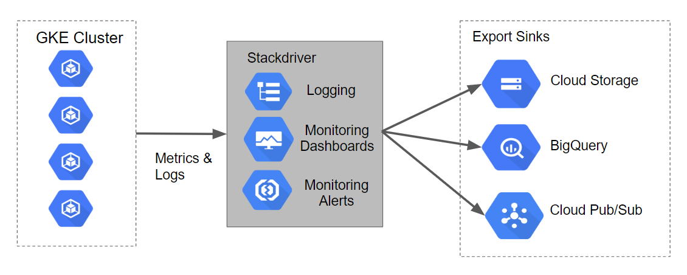
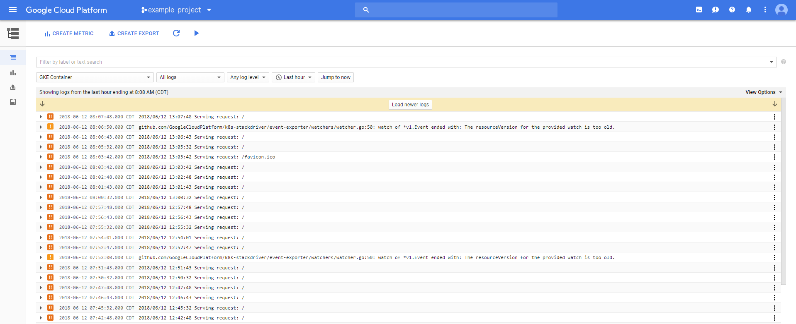
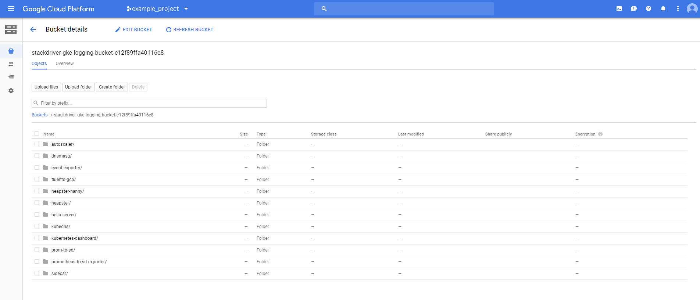
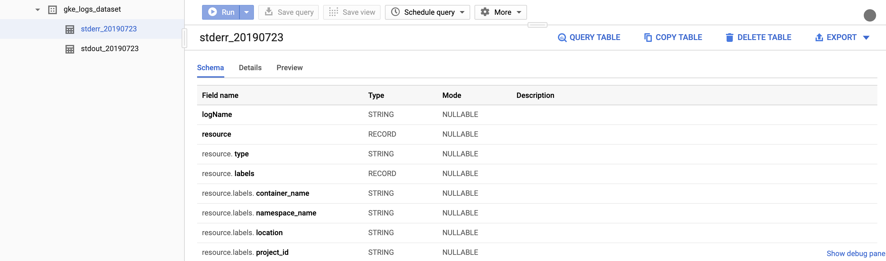

# Logging to Stackdriver on GKE

## Table of Contents

<!-- toc -->
* [Introduction](#introduction)
* [Architecture](#architecture)
* [Prerequisites](#prerequisites)
* [Deployment](#deployment)
* [Validation](#validation)
  * [Logs in the Stackdriver UI](#logs-in-the-stackdriver-ui)
  * [Viewing Log Exports](#viewing-log-exports)
  * [Logs in Cloud Storage](#logs-in-cloud-storage)
  * [Logs in BigQuery](#logs-in-bigquery)
* [Teardown](#teardown)
* [Next Steps](#next-steps)
* [Troubleshooting](#troubleshooting)
* [Relevant Material](#relevant-material)
<!-- toc -->

## Introduction

Stackdriver Logging can be used aggregate logs from all GCP resources as well as any custom resources (on other platforms) to allow for one centralized store for all logs and metrics.  Logs are aggregated and then viewable within the provided Stackdriver Logging UI. By default, access logs captured by Stackdriver are only available for 30 days.  If you want to archive logs for a longer period, export logs to another system, or perform analysis on the logs themselves, they can be [exported via Log Sinks](https://cloud.google.com/logging/docs/export/configure_export_v2) to one or more destinations.  Currently, Stackdriver Logging supports exporting to the following sinks:

* Cloud Storage
* Pub/Sub
* BigQuery

This document will describe the steps required to create GCS and Bigquery sinks that forwards log events from the private cluster created to [Stackdriver Logging](https://cloud.google.com/logging/). It makes use of [Terraform](https://www.terraform.io/), a declarative [Infrastructure as Code](https://en.wikipedia.org/wiki/Infrastructure_as_Code) tool that enables configuration files to be used to automate the deployment and evolution of infrastructure in the cloud.  The configuration will also create a Cloud Storage bucket and a BigQuery dataset for exporting log data to.

## Architecture

The Terraform configurations scripts will build out Logging Export Sinks for Cloud Storage, BigQuery.  The diagram of how this will look along with the data flow can be seen in the following graphic.



## Prerequisites

### Deploy the Base Cluster

Deploy the base cluster in the target project as per the instructions in the top-level [README](../README.md#provisioning-the-kubernetes-engine-cluster) and configure your terminal to [access the private cluster](../README.md#accessing-the-private-cluster).

### Required GCP APIs

The following APIs will be enabled in the current project in addition to those already enabled during base cluster creation:

* BigQuery API

## Deployment

The steps below will walk you through using terraform to deploy Stackdriver resources to a Kubernetes Engine cluster created by the [instructions at the root of this repository](../../README.md).

From within the project root, use `make create` to apply the terraform:

```console
cd holistic-demo/logging-sinks
make create
```

```console
...snip...
Apply complete! Resources: 7 added, 0 changed, 0 destroyed.
```

## Validation

If no errors are displayed during deployment, after a few minutes you should see your Storage bucket and bigquery datasets created on your project.

We can use the [Stackdriver UI](https://console.cloud.google.com/logs) and other tools to view it.

### Logs in the Stackdriver UI

Stackdriver provides a UI for viewing log events. Basic search and filtering features are provided, which can be useful when debugging system issues. The Stackdriver Logging UI is best suited to exploring more recent log events. Users requiring longer-term storage of log events should consider some of the tools in following sections.

To access the Stackdriver Logging console perform the following steps:

1. In the GCP console navigate to the **Stackdriver -> Logging** page.
2. The default logging console will load.  On this page change the resource filter to be **Kubernetes Container -> demo-cluster -> default** (the **stackdriver-logging** is the cluster; and the **default** is the namespace).  Your screen should look similar the screenshot below.
3. On this screen you can expand the bulleted log items to view more complete details about the log entry.



In the logging console you can perform any type of text search, or try the various filters by log type, log level, timeframe, etc.

### Viewing Log Exports

The Terraform configuration built out two Log Export Sinks.  To view the sinks perform the following steps:

1. In the GCP console navigate to the **Stackdriver -> Logging** page.
2. The default logging console will load.  On the left navigation click on the **Exports** menu option.
3. This will bring you to the **Exports** page.  You should see two Sinks in the list of log exports.
4. You can edit/view these sinks by clicking on the context menu to the right and selecting the **Edit sink** option.
5. Additionally, you could create additional custom export sinks by clicking on the **Create Export** option in the top of the navigation window.

### Logs in Cloud Storage

Log events can be stored in [Cloud Storage](https://cloud.google.com/storage/), an object storage system suitable for archiving data. Policies can be configured for Cloud Storage buckets that, for instance, allow aging data to expire and be deleted while more recent data can be stored with a variety of storage classes affecting price and availability.

The Terraform configuration created a Cloud Storage Bucket named `stackdriver-gke-logging-<random-id>` to which logs will be exported for medium to long-term archival.  In this example, the Storage Class for the bucket is defined as Nearline because the logs should be infrequently accessed in a normal production environment (this will help to manage the costs of medium-term storage).  In a production scenario this bucket may also include a lifecycle policy that moves the content to Coldline storage for cheaper long-term storage of logs.

To access the Stackdriver logs in Cloud Storage perform the following steps:

**Note:** Logs from Cloud Storage Export are not populated immediately.  It may take up to 2-3 hours for logs to appear.

1. In the GCP console navigate to the **Storage -> Storage** page.
2. This loads the Cloud Storage Browser page.  On the page find the Bucket with the name `stackdriver-gke-logging-<random-id>`, and click on the name (which is a hyperlink).
3. This will show the details of the bucket.  You should see a list of directories corresponding to pods running in the cluster (eg autoscaler, dnsmasq, etc.).



On this page you can click into any of the named folders to browse specific log details like heapster, kubedns, sidecar, etc.

### Logs in BigQuery

Stackdriver log events can be configured to be published to [BigQuery](https://cloud.google.com/bigquery/), a data warehouse tool that supports fast, sophisticated, querying over large  data sets.

The Terraform configuration will create a BigQuery [DataSet](https://cloud.google.com/bigquery/docs/reference/rest/v2/datasets) named `gke_logs_dataset`.  This dataset will be setup to include all Kubernetes Engine related logs for the last hour (by setting a Default Table Expiration for the dataset).  A Stackdriver Export will be created that pushes Kubernetes Engine container logs to the dataset.

To access the Stackdriver logs in BigQuery perform the following steps:

**Note:** The BigQuery Export is not populated immediately.  It may take a few minutes for logs to appear.

1. In the GCP console navigate to the **Big Data -> BigQuery** page.
2. This loads a new browser tab with the BigQuery console.
3. On the left hand console you will have a display of the datasets you have access to.  You should see a dataset named **gke_logs_dataset**.  Expand this dataset to view the tables that exist (**Note:** The dataset is created immediately, but the tables are what is generated as logs are written and new tables are needed).
4. Click on one of the tables to view the table details.  Your screen should look similar to the screenshot below.
5. Review the schema of the table to note the column names and their data types.  This information can be used in the next step when we query the table to look at the data.
  
6. Click on the **Query Table** towards the top right to perform a custom query against the table.
7. This opens the query window.  You can simply add an asterisk (*) after the **Select** in the window to pull all details from the current table. **Note:** A 'Select *' query is generally very expensive and not advised.  For this tutorial the dataset is limited to only the last hour of logs so the overall dataset is relatively small.
8. Click the **Run Query** button to execute the query and return some results from the table.
9. A popup window till ask you to confirm running the query.  Click the **Run Query** button on this window as well.
10. The results window should display some rows and columns.  You can scroll through the various rows of data that are returned, or download the results to a local file.
11. Execute some custom queries that filter for specific data based on the results that were shown in the original query.

## Teardown

The resources created as a part of this demo can be deleted without affecting resources needed by other topic areas covered in this repository.

To delete just the resources created for this topic area (leaving the base cluster as-is), run:

```console
make teardown
```

If you would like to continue working on other topics, refer to the [next steps](#next-steps).

If you are completely finished working with the contents of this repository, follow the [teardown steps](../README.md#teardown) in the top-level [README](../README.md#teardown) to remove the cluster and supporting resources.

## Next Steps

Return to the top-level [README](../README.md#guided-demos) to begin working on another topic area.

## Troubleshooting

### The install script fails with a `Permission denied` when running Terraform

The credentials that Terraform is using do not provide the necessary permissions to create resources in the selected projects. Ensure that the account listed in `gcloud config list` has necessary permissions to create resources. If it does, regenerate the application default credentials using `gcloud auth application-default login`.

### Cloud Storage Bucket not populated

Once the Terraform configuration is complete the Cloud Storage Bucket will be created but it is not always populated immediately with log data from the Kubernetes Engine cluster.  The logs details rarely populate in the bucket immediately.  Give the process some time because it can take up to 2 to 3 hours before the first entries start appearing. Refer to [using exported logs](https://cloud.google.com/logging/docs/export/using_exported_logs).

### No tables created in the BigQuery dataset

Once the Terraform configuration is complete the BigQuery Dataset will be created but it will not always have tables created in it by the time you go to review the results.  The tables are rarely populated immediately.  Give the process some time (minimum of 5 minutes) before determining that something is not working properly.

## Relevant Material

* [Kubernetes Engine Logging](https://cloud.google.com/kubernetes-engine/docs/how-to/logging)
* [Viewing Logs](https://cloud.google.com/logging/docs/view/overview)
* [Advanced Logs Filters](https://cloud.google.com/logging/docs/view/advanced-filters)
* [Overview of Logs Exports](https://cloud.google.com/logging/docs/export/)
* [Procesing Logs at Scale Using Cloud Dataflow](https://cloud.google.com/solutions/processing-logs-at-scale-using-dataflow)
* [Terraform Google Cloud Provider](https://www.terraform.io/docs/providers/google/index.html)

Note, **this is not an officially supported Google product**.
