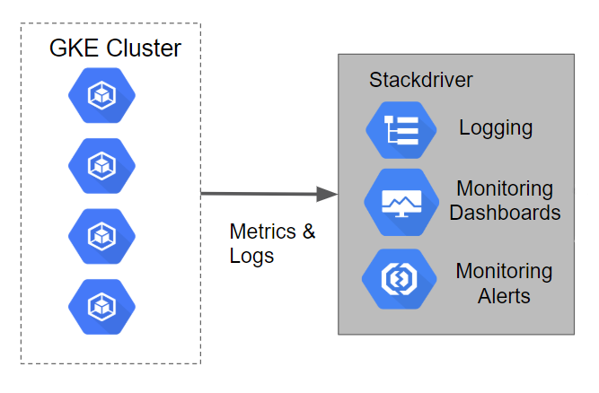

# Monitoring with Stackdriver on Kubernetes Engine

## Table of Contents

<!-- toc -->
* [Introduction](#introduction)
* [Architecture](#architecture)
* [Prerequisites](#prerequisites)
* [Deployment](#deployment)
  * [Create a new Stackdriver Account](#create-a-new-stackdriver-account)
  * [Using Stackdriver Kubernetes Monitoring](#using-stackdriver-kubernetes-monitoring)
* [Next Steps](#next-steps)
* [Teardown](#next-steps)
* [Troubleshooting](#troubleshooting)
* [Relevant Material](#relevant-material)
<!-- toc -->

## Introduction

[Stackdriver Kubernetes Monitoring](https://cloud.google.com/monitoring/kubernetes-engine/) is a Stackdriver feature that more tightly integrates with GKE to better show you key stats about your cluster and the workloads and services running in it. Included in the new feature is functionality to import, as native Stackdriver metrics, metrics from pods with Prometheus endpoints. This allows you to use Stackdriver native alerting functionality with your Prometheus metrics without any additional workload.

This tutorial will walk you through setting up Monitoring and visualizing metrics from a private GKE cluster.  It makes use of [Terraform](https://www.terraform.io/), a declarative [Infrastructure as Code](https://en.wikipedia.org/wiki/Infrastructure_as_Code) tool that enables configuration files to be used to automate the deployment and evolution of infrastructure in the cloud.  The logs from the Kubernetes Engine cluster will be leveraged to walk through the monitoring capabilities of Stackdriver.

## Architecture

The tutorial will walk you through logging and metrics for the cluster loaded into Stackdriver Logging by default.  In the tutorial a Stackdriver Monitoring account will be setup to view the metrics captured for a Kubernetes Engine cluster.

## Prerequisites

### Deploy the Base Cluster

Deploy the base cluster in the target project as per the instructions in the top-level [README](../README.md#provisioning-the-kubernetes-engine-cluster) and configure your terminal to [access the private cluster](../README.md#accessing-the-private-cluster).

## Deployment

Make sure that the Kubernetes Engine cluster has been created by the [instructions at the root of this repository](../../README.md).

In this section we will create a Stackdriver Monitoring account so that we can explore the capabilities of the Monitoring console.

### Create a new Stackdriver Account

The following steps are used to setup a Stackdriver Monitoring account.

1. Visit the **Monitoring** section of the GCP Console.  This will launch the process of creating a new Monitoring console if you have not created one before.
2. On the **Create your free StackDriver account** page select the project you created earlier.  **Note:** You cannot change this setting once it is created.
3. Click on the **Create Account** button.
4. On the next page, **Add Google Cloud Platform projects to monitor** you can leave this alone since the project is already selected it isn't necessary to select any other projects.  **Note:** You can add and remove projects at a later date if necessary.
5. Click the **Continue** button.
6. On the **Monitor AWS accounts** page you can choose to specify your AWS account information or skip this step.
7. For this tutorials purposes you can click the **Skip AWS Setup** button.
8. On the **Install the Stackdriver Agents** page you are provided with a script that can be used to add the Stackdriver Monitoring and Logging agents on each of your VM instances.  **Note:** The tracking of VM's is not automatic like it is for Kubernetes Engine.  For the purposes of this tutorial this script is not needed.
9. Click the **Continue** button.
10. On the **Get Reports by Email** page you can simply select any of the options depending on whether you want to receive the reports.  For the purposes of this demo we will not be using the reports.
11. Click the **Continue** button.
12. The actual creation of the account and underlying resources takes a few minutes.  Once completed you can press the **Launch monitoring** button.

### Using Stackdriver Kubernetes Monitoring

For a thorough guide on how to observe your cluster with the new Stackdriver Kubernetes UI, follow the steps in [Observing Your Kubernetes Clusters](https://cloud.google.com/monitoring/kubernetes-engine/observing).

## Next Steps

Return to the top-level [README](../README.md#guided-demos) to begin working on another topic area.

## Teardown

The resources created as a part of this demo do not need to be deleted explicitly. If you would like to continue working on other topics, refer to the [next steps](#next-steps).

If you are completely finished working with the contents of this repository, follow the [teardown steps](../README.md#teardown) in the top-level [README](../README.md#teardown) to remove the cluster and supporting resources.

## Troubleshooting

### Metrics Not Appearing or Uptime Checks not executing

After the scripts execute it may take a few minutes for the Metrics or Uptime Checks to appear.  Configure the items and give the system some time to generate metrics and checks as they someimes take time to complete.

## Relevant Material

* [Stackdriver Kubernetes Monitoring](https://cloud.google.com/monitoring/kubernetes-engine/)
* [Terraform Google Cloud Provider](https://www.terraform.io/docs/providers/google/index.html)

Note, **this is not an officially supported Google product**.
