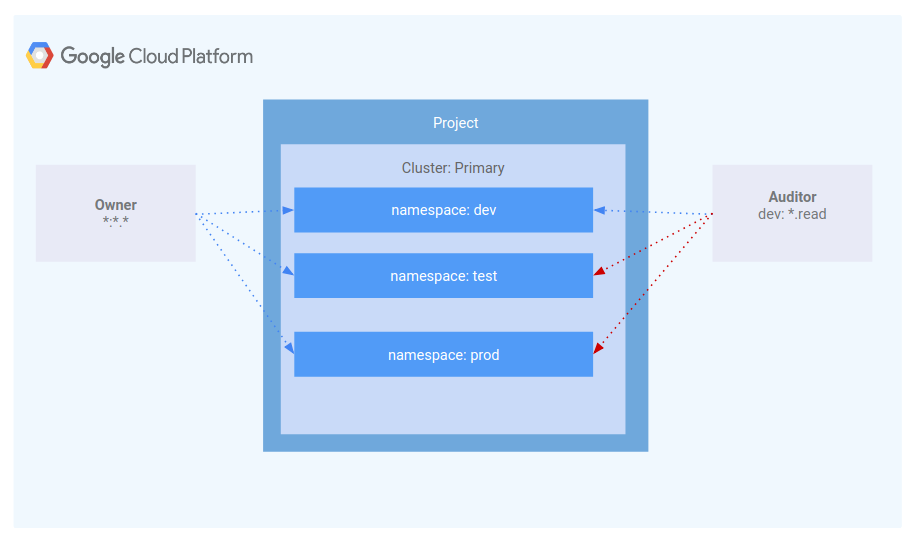
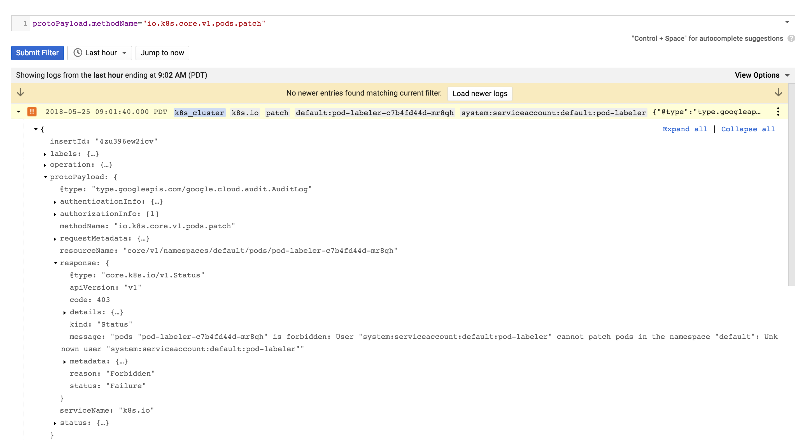

# Using Role-Based Access Control in Kubernetes Engine

## Table of Contents

<!-- TOC -->
* [Introduction](#introduction)
* [Architecture](#architecture)
* [Prerequisites](#prerequisites)
* [Deployment](#deployment)
* [Validation](#validation)
* [Scenario 1: Assigning permissions by user persona](#scenario-1-assigning-permissions-by-user-persona)
* [Scenario 2: Assigning API permissions to a cluster application](#scenario-2-assigning-api-permissions-to-a-cluster-application)
* [Next Steps](#next-steps)
* [Teardown](#teardown)
* [Relevant Material](#relevant-material)
<!-- TOC -->

## Introduction

This tutorial covers the usage and debugging of [role-based access control (RBAC)](https://kubernetes.io/docs/reference/access-authn-authz/rbac/) in a Kubernetes Engine cluster.

While RBAC resource definitions are standard across all Kubernetes platforms. Their interaction with underlying authentication and authorization providers need to be understood when building on any cloud provider.

RBAC is a powerful security mechanism that provides great flexibility in how you restrict operations within a cluster. This tutorial will cover two use cases for RBAC:

1. Assigning different permissions to user personas, namely owners and auditors.
1. Granting limited API access to an application running within your cluster.

Since RBAC's flexibility can occasionally result in complex rules, common steps for troubleshooting RBAC are included as part of scenario 2.

## Architecture

This tutorial focuses on the use of RBAC within a Kubernetes Engine cluster. It demonstrates how varying levels of cluster privilege can be granted to different user personas. In particular, you will provision two service accounts to represent user personas and three namespaces: dev, test, and prod. The "owner" persona will have read-write access to all three namespaces, while the "auditor" persona will have read-only access and be restricted to the dev namespace.



## Prerequisites

### Deploy the Base Cluster

Deploy the base cluster in the target project as per the instructions in the top-level [README](../README.md#provisioning-the-kubernetes-engine-cluster) and configure your terminal to [access the private cluster](../README.md#accessing-the-private-cluster)

## Deployment

The steps below will walk you through using terraform to deploy applications and RBAC resources to a Kubernetes Engine cluster created by the [instructions at the root of this repository](../../README.md).

### Provisioning the Applications and RBAC Configuration

Create the necessary Service Account and IAM Roles:

```console
cd holistic-demo/rbac
make create
```

When prompted if you want to deploy the plan, review the generated plan and enter `yes` to deploy the changes to the environment.

## Validation

Once complete, terraform will output a message indicating successful creation of the cluster.

```console
...snip...
Apply complete! Resources: 12 added, 0 changed, 0 destroyed.

Outputs:

admin_sa_key = <sensitive>
admin_sa_name = gke-tutorial-admin-rbac@my-project-id.iam.gserviceaccount.com
auditor_sa_key = <sensitive>
auditor_sa_name = gke-tutorial-auditor-rbac@my-project-id.iam.gserviceaccount.com
owner_sa_key = <sensitive>
owner_sa_name = gke-tutorial-owner-rbac@my-project-id.iam.gserviceaccount.com
```

## Scenario 1: Assigning permissions by user persona

### IAM - Role

A role named `kube-api-ro-xxxxxxxx` (where `xxxxxxxx` is a random string) has been created with the permissions below as part of the terraform configuration in `iam.tf`. These permissions are the minimum required for any user that requires access to the Kubernetes API.

1. `container.apiServices.get`
1. `container.apiServices.list`
1. `container.clusters.get`
1. `container.clusters.getCredentials`

### Simulating users

Three service accounts have been created to act as Test Users:

* `admin` has admin permissions over the cluster and all resources
* `owner` has read-write permissions over common cluster resources
* `auditor` has read-only permissions within the dev namespace only

```console
gcloud iam service-accounts list

NAME                                    EMAIL
GKE Tutorial Admin                      gke-tutorial-admin@myproject.iam.gserviceaccount.com
GKE Tutorial Auditor                    gke-tutorial-auditor@myproject.iam.gserviceaccount.com
GKE Tutorial Owner                      gke-tutorial-owner@myproject.iam.gserviceaccount.com
```

### Creating the RBAC rules

Switch to the `admin` service account:

```console
make admin

Switching to SA: admin
```

Create the the namespaces, Roles, and RoleBindings by applying the `rbac.yaml` manifest:

```console
k apply -f ./manifests/rbac.yaml

namespace "dev" created
namespace "prod" created
namespace "test" created
role.rbac.authorization.k8s.io "dev-ro" created
clusterrole.rbac.authorization.k8s.io "all-rw" created
clusterrolebinding.rbac.authorization.k8s.io "owner-binding" created
rolebinding.rbac.authorization.k8s.io "auditor-binding" created
```

### Managing resources as the owner

Switch to the `owner` service account:

```console
make owner

Switching to SA: owner
```

Create a `hello-server` deployment in each namespace:

```console
k create -n dev -f ./manifests/hello-server.yaml

service/hello-server created
deployment.apps/hello-server created
```

```console
k create -n prod -f ./manifests/hello-server.yaml

service/hello-server created
deployment.apps/hello-server created
```

```console
k create -n test -f ./manifests/hello-server.yaml

service/hello-server created
deployment.apps/hello-server created
```

As the owner, you will also be able to view all pods:

```console
k get pods -l app=hello-server --all-namespaces

NAMESPACE   NAME                            READY     STATUS    RESTARTS   AGE
dev         hello-server-6c6fd59cc9-h6zg9   1/1       Running   0          6m
prod        hello-server-6c6fd59cc9-mw2zt   1/1       Running   0          44s
test        hello-server-6c6fd59cc9-sm6bs   1/1       Running   0          39s
```

### Viewing resources as the auditor

Switch to the `auditor` service account:

```console
make auditor

Switching to SA: auditor
```

Attempt to list all pods:

```console
k get pods -l app=hello-server --all-namespaces

Error from server (Forbidden): pods is forbidden: User "gke-tutorial-auditor@myproject.iam.gserviceaccount.com" cannot list pods at the cluster scope: Required "container.pods.list" permission
```

The error indicates you don't have sufficient permissions. The auditor is restricted to viewing only the resources in the dev namespace, so you'll need to specify the namespace when viewing resources.

Attempt to view pods in the dev namespace

```console
k get pods -l app=hello-server --namespace=dev

NAME                            READY     STATUS    RESTARTS   AGE
hello-server-6c6fd59cc9-h6zg9   1/1       Running   0          13m
```

Attempt to view pods in the test namespace

```console
k get pods -l app=hello-server --namespace=test

Error from server (Forbidden): pods is forbidden: User "gke-tutorial-auditor@myproject.iam.gserviceaccount.com" cannot list pods in the namespace "test": Required "container.pods.list" permission.
```

Attempt to view pods in the prod namespace

```console
k get pods -l app=hello-server --namespace=prod

Error from server (Forbidden): pods is forbidden: User "gke-tutorial-auditor@myproject.iam.gserviceaccount.com" cannot list pods in the namespace "prod": Required "container.pods.list" permission.
```

Finally, verify the that the auditor has read-only access by trying to create and delete a deployment in the dev namespace:

```console
k create -n dev -f manifests/hello-server.yaml

Error from server (Forbidden): error when creating "manifests/hello-server.yaml": services is forbidden: User "gke-tutorial-auditor@myproject.iam.gserviceaccount.com" cannot create services in the namespace "dev": Required "container.services.create" permission.
Error from server (Forbidden): error when creating "manifests/hello-server.yaml": deployments.extensions is forbidden: User "gke-tutorial-auditor@myproject.iam.gserviceaccount.com" cannot create deployments.extensions in the namespace "dev": Required "container.deployments.create" permission.
```

```console
k delete deployment -n dev -l app=hello-server

Error from server (Forbidden): deployments.extensions "hello-server" is forbidden: User "gke-tutorial-auditor@myproject.iam.gserviceaccount.com" cannot update deployments.extensions in the namespace "dev": Required "container.deployments.update" permission.
```

## Scenario 2: Assigning API permissions to a cluster application

In this scenario you'll go through the process of deploying an application that requires access to the Kubernetes API as well as configure RBAC rules while troubleshooting some common use cases.

### Deploying the sample application

The sample application will run as a single pod that periodically retrieves all pods in the default namespace from the API server and then applies a timestamp label to each one.

Deploy the pod-labeler application. This will also deploy a Role, ServiceAccount, and RoleBinding for the pod.

Switch to the `admin` service account:

```console
make admin

Switching to SA: admin
```

Apply the pod-labeler configuration:

```console
k apply -f manifests/pod-labeler.yaml

role.rbac.authorization.k8s.io/pod-labeler created
serviceaccount/pod-labeler created
rolebinding.rbac.authorization.k8s.io/pod-labeler created
deployment.apps/pod-labeler created
```

### Diagnosing an RBAC misconfiguration

Now check the status of the pod. Once the container has finished creating, you'll see it error out. Investigate the error by inspecting the pod's events and logs:

```console
k get pods -l app=pod-labeler

NAME                           READY     STATUS    RESTARTS   AGE
pod-labeler-6d9757c488-tk6sp   0/1       Error     1          1m
```

View the most recent pod events:

```console
k describe pod -l app=pod-labeler | tail -n 20

Events:
  Type     Reason     Age                     From                                                       Message
  ----     ------     ----                    ----                                                       -------
  Normal   Scheduled  7m35s                   default-scheduler                                          Successfully assigned default/pod-labeler-5b4bd6cf9-w66jd to gke-rbac-demo-cluster-default-pool-3d348201-x0pk
  Normal   Pulling    7m34s                   kubelet, gke-demo-cluster-default-pool-3d348201-x0pk  pulling image "gcr.io/pso-examples/pod-labeler:0.1.5"
  Normal   Pulled     6m56s                   kubelet, gke-demo-cluster-default-pool-3d348201-x0pk  Successfully pulled image "gcr.io/pso-examples/pod-labeler:0.1.5"
  Normal   Created    5m29s (x5 over 6m56s)   kubelet, gke-demo-cluster-default-pool-3d348201-x0pk  Created container
  Normal   Pulled     5m29s (x4 over 6m54s)   kubelet, gke-demo-cluster-default-pool-3d348201-x0pk  Container image "gcr.io/pso-examples/pod-labeler:0.1.5" already present on machine
  Normal   Started    5m28s (x5 over 6m56s)   kubelet, gke-demo-cluster-default-pool-3d348201-x0pk  Started container
  Warning  BackOff    2m25s (x23 over 6m52s)  kubelet, gke-demo-cluster-default-pool-3d348201-x0pk  Back-off restarting failed container

```

Check the pod's logs:

```console
k logs -l app=pod-labeler

Attempting to list pods
...snip...
Reason: Forbidden
HTTP response headers: HTTPHeaderDict({'Date': 'Fri, 25 May 2018 15:33:15 GMT', 'Audit-Id': 'ae2a0d7c-2ab0-4f1f-bd0f-24107d3c144e', 'Content-Length': '307', 'Content-Type': 'application/json', 'X-Content-Type-Options': 'nosniff'})
HTTP response body: {"kind":"Status","apiVersion":"v1","metadata":{},"status":"Failure","message":"pods is forbidden: User \"system:serviceaccount:default:default\" cannot list pods in the namespace \"default\": Unknown user \"system:serviceaccount:default:default\"","reason":"Forbidden","details":{"kind":"pods"},"code":403}
```

Based on this error, you can see a permissions error when trying to list pods via the API. The next step is to confirm you are using the correct ServiceAccount:

### Fixing the serviceAccountName

By inspecting the pod's configuration, you can see it is using the default ServiceAccount rather than the custom Service Account:

```console
k get pod -oyaml -l app=pod-labeler

...
restartPolicy: Always
schedulerName: default-scheduler
securityContext: {}
serviceAccount: default
...
```

The `pod-labeler-fix-1.yaml` file contains the fix in the deployment's template spec:

```yaml
      # Fix 1, set the serviceAccount so RBAC rules apply
      serviceAccount: pod-labeler
```

Apply the fix and view the resulting change:

```console
k apply -f manifests/pod-labeler-fix-1.yaml

role.rbac.authorization.k8s.io/pod-labeler unchanged
serviceaccount/pod-labeler unchanged
rolebinding.rbac.authorization.k8s.io/pod-labeler unchanged
deployment.apps/pod-labeler configured
```

Now, confirm the change in the deployment configuration:

```console
k get deployment pod-labeler -oyaml

  ...
  restartPolicy: Always
  schedulerName: default-scheduler
  securityContext: {}
  serviceAccount: pod-labeler
  ...

```

### Diagnosing insufficient privileges

Once again, check the status of the pod and you'll notice it is still erroring out, but with a different message this time:

```console
k get pods -l app=pod-labeler

NAME                          READY     STATUS             RESTARTS   AGE
pod-labeler-c7b4fd44d-mr8qh   0/1       CrashLoopBackOff   3          1m

```

View the pod's logs:

```console
k logs -l app=pod-labeler

Attempting to list pods
...snip...
Reason: Forbidden
HTTP response headers: HTTPHeaderDict({'Date': 'Fri, 25 May 2018 16:01:40 GMT', 'Audit-Id': '461fa750-57c9-4fea-8717-f1778828417f', 'Content-Length': '385', 'Content-Type': 'application/json', 'X-Content-Type-Options': 'nosniff'})
HTTP response body: {"kind":"Status","apiVersion":"v1","metadata":{},"status":"Failure","message":"pods \"pod-labeler-c7b4fd44d-mr8qh\" is forbidden: User \"system:serviceaccount:default:pod-labeler\" cannot patch pods in the namespace \"default\": Unknown user \"system:serviceaccount:default:pod-labeler\"","reason":"Forbidden","details":{"name":"pod-labeler-c7b4fd44d-mr8qh","kind":"pods"},"code":403}
```

Since this is failing on a `PATCH` operation, you can also see the error in Stackdriver. This is useful if the application logs are not sufficiently verbose. In the Stackdriver Logging page, click on the small "down arrow" at the far right of the search input, choose `Convert to Advanced Filter` and filter by:

```console
protoPayload.methodName="io.k8s.core.v1.pods.patch"
```



### Identifying the application's role and permissions

Use the `ClusterRoleBinding` to view the ServiceAccount's current Role and permissions:

```yaml
k get rolebinding pod-labeler -oyaml

apiVersion: rbac.authorization.k8s.io/v1
kind: RoleBinding
metadata:
  creationTimestamp: 2018-06-01T18:49:18Z
  name: pod-labeler
  namespace: default
  resourceVersion: "8309"
  selfLink: /apis/rbac.authorization.k8s.io/v1/clusterrolebindings/pod-labeler
  uid: 7d16fff7-65cc-11e8-a48a-42010a005a04
roleRef:
  apiGroup: rbac.authorization.k8s.io
  kind: Role
  name: pod-labeler
subjects:
- kind: ServiceAccount
  name: pod-labeler
  namespace: default
```

The RoleBinding shows you need to inspect the `pod-labeler` Role in the `default` namespace. Here you can see the role is only granted permission to list pods.

```yaml
k get role pod-labeler -oyaml

apiVersion: rbac.authorization.k8s.io/v1
kind: Role
metadata:
  annotations:
    kubectl.kubernetes.io/last-applied-configuration: |
      {"apiVersion":"rbac.authorization.k8s.io/v1","kind":"Role","metadata":{"annotations":{},"name":"pod-labeler","namespace":"default"},"rules":[{"apiGroups":[""],"resources":["pods"],"verbs":["list","patch"]}]}
  creationTimestamp: 2018-06-21T20:34:11Z
  name: pod-labeler
  namespace: default
  resourceVersion: "1288"
  selfLink: /apis/rbac.authorization.k8s.io/v1/namespaces/default/roles/pod-labeler
  uid: 748b40f4-7592-11e8-a757-42010a005a03
rules:
- apiGroups:
  - ""
  resources:
  - pods
  verbs:
  - list
```

Since the application requires PATCH permissions, you can add it to the "verbs" list
of the role.

The `pod-labeler-fix-2.yaml` file contains the fix in it's rules/verbs section:

```yaml
rules:
- apiGroups: [""] # "" refers to the core API group
  resources: ["pods"]
  verbs: ["list","patch"] # Fix 2: adding permission to patch (update) pods
```

Apply the fix:

```console
k apply -f manifests/pod-labeler-fix-2.yaml

role.rbac.authorization.k8s.io/pod-labeler configured
serviceaccount/pod-labeler unchanged
rolebinding.rbac.authorization.k8s.io/pod-labeler unchanged
deployment.apps/pod-labeler configured
```

View the updated RBAC `Role` permissions and see that `PATCH` was added:

```console
k get role pod-labeler -oyaml

apiVersion: rbac.authorization.k8s.io/v1
kind: Role
metadata:
  annotations:
    kubectl.kubernetes.io/last-applied-configuration: |
      {"apiVersion":"rbac.authorization.k8s.io/v1","kind":"ClusterRole","metadata":{"annotations":{},"name":"pod-labeler","namespace":""},"rules":[{"apiGroups":[""],"resources":["pods"],"verbs":["list"]}]}
  creationTimestamp: 2018-05-25T15:52:24Z
  name: pod-labeler
  resourceVersion: "62483"
  selfLink: /apis/rbac.authorization.k8s.io/v1/clusterroles/pod-labeler
  uid: 9e2dc8c5-6033-11e8-a97b-42010a005a03
rules:
- apiGroups:
  - ""
  resources:
  - pods
  verbs:
  - list
  - patch
```

Because the pod-labeler may be in a back-off loop, the quickest way to test our fix is to kill the existing pod and let a new one take it's place:

```console
k delete pod -l app=pod-labeler

pod "pod-labeler-8845f6488-5fpt9" deleted
```

### Verifying successful configuration

Finally, verify the new `pod-labeler` pod is running and check that the `updated` label has been applied.

```console
k get pods --show-labels

NAME                          READY     STATUS    RESTARTS   AGE       LABELS
pod-labeler-c7b4fd44d-8g8ws   1/1       Running   0          1m        pod-template-hash=736098008,run=pod-labeler,updated=1527264742.09
```

View the `pod-labeler` pod's logs:

```console
k logs -l app=pod-labeler

Attempting to list pods
labeling pod pod-labeler-6d9757c488-dftcr
labeling pod pod-labeler-c7b4fd44d-8g8ws
labeling pod python-b89455c85-m284f
```

### Key take-aways

* Container and API server logs will be your best source of clues for diagnosing RBAC issues.
* Use `RoleBindings` or `ClusterRoleBindings` to determine which role is specifying the permissions for a pod.
* API server logs can be found in Stackdriver under the Kubernetes resource.
* Not all API calls will be logged to stack driver. Frequent, or verbose payloads are omitted by the Kubernetes' audit policy used in Kubernetes Engine. The exact policy will vary by Kubernetes version, but can be found in the [open source codebase](https://github.com/kubernetes/kubernetes/blob/master/cluster/gce/gci/configure-helper.sh#L740)

## Next Steps

Return to the top-level [README](../README.md#guided-demos) to begin working on another topic area.

## Teardown

Gcloud is most likely still authenticated as one of the generated IAM service accounts.  To re-login as your primary gcloud user, run:

```console
gcloud auth login
```

The resources created by this RBAC demo can be removed without harming any resources used by other subject areas.  Ensure this command is being run from the `holistic-demo/rbac` directory and *not* the root of the repository:

```console
cd holistic-demo/rbac
make teardown
```

If you would like to continue working on other topics, refer to the [next steps](#next-steps).

If you are completely finished working with the contents of this repository, follow the [teardown steps](../README.md#teardown) in the top-level [README](../README.md#teardown) to remove the cluster and supporting resources.

## Relevant Material

* [Kubernetes Engine Role-Based Access Control](https://cloud.google.com/kubernetes-engine/docs/how-to/role-based-access-control)
* [Kubernetes Engine IAM Integration](https://cloud.google.com/kubernetes-engine/docs/how-to/iam-integration)
* [Kubernetes Service Account Authentication](https://kubernetes.io/docs/reference/access-authn-authz/authentication/#service-account-tokens)
* [Terraform Documentation](https://www.terraform.io/docs/providers/google/index.html)

Note, **this is not an officially supported Google product**.
